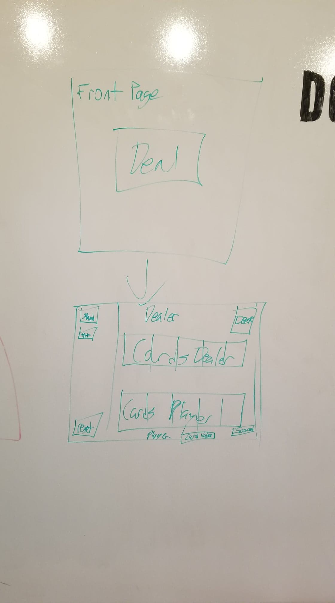

#Descritpion

Do you think you're lucky?

Welcome to Black Jack, a staple of Casinos. This is a simple Javascript based game aimed to see who is lucky, and who may go a little too far with their luck.

Javascript checks to see who is the winner of each math through various If statements and changes the cards and text on the screen through DOM Manipulation. 

Anime.js has been used to create the 'dealing' animation.

CSS has various changes to opacity, direct color changes, RGB useage, and CSS Grid/Flexbox for text positioning.

HTML is basic, as all logic is within script.js

#App

https://nekublackjack.netlify.com/ //may lag upon first open//

#Trello

https://trello.com/b/6LhTqE7O/unit-1-project-black-jack

#Wireframe

#Tech/Libraries/Frameworks

JS Library: Underscore.js

JS Library: jQuery

css-Grid: https://css-tricks.com/snippets/css/complete-guide-grid/

Free Card Set: http://acbl.mybigcommerce.com/52-playing-cards/

Flexbox: https://css-tricks.com/snippets/css/a-guide-to-flexbox/

anime.js: https://animejs.com/

#Version 2 revision

More animations, adding sounds, player score, Player/Dealer side choice, 2 player mode